..  _gallery:
.. raw:: html

    <video autoplay loop poster="_static/gallery_static.png">
        <source src="_static/gallery.mp4" type="video/mp4">
        <source src="_static/gallery.webm" type="video/webm">
        Sorry, your browser doesn't support HTML5 video.
    </video>

Gallery
**************************

This section contains a gallery of visual representations of pyGDM simulations. Clicking on the image leads to a corresponding example or tutorial page where the shown results are reproduced.

|
|

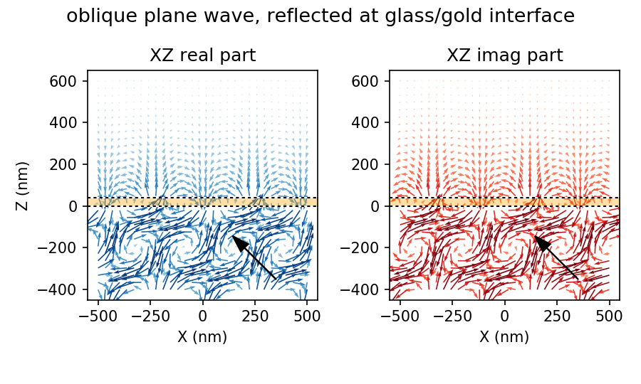
   
|
|

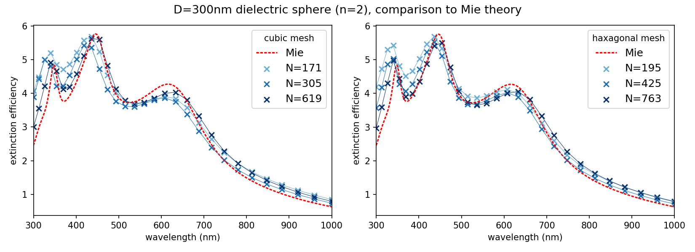
   
|
|

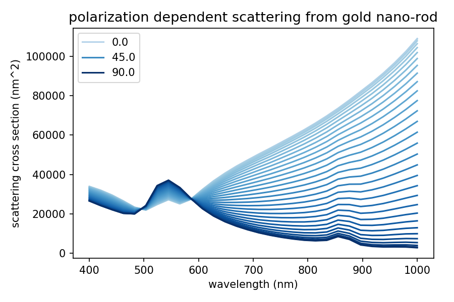

|
|

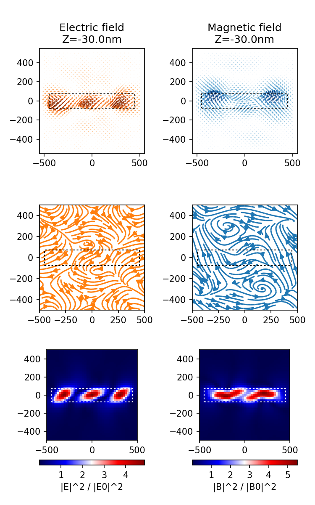

|
|

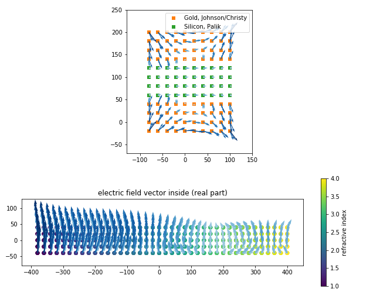

|
|

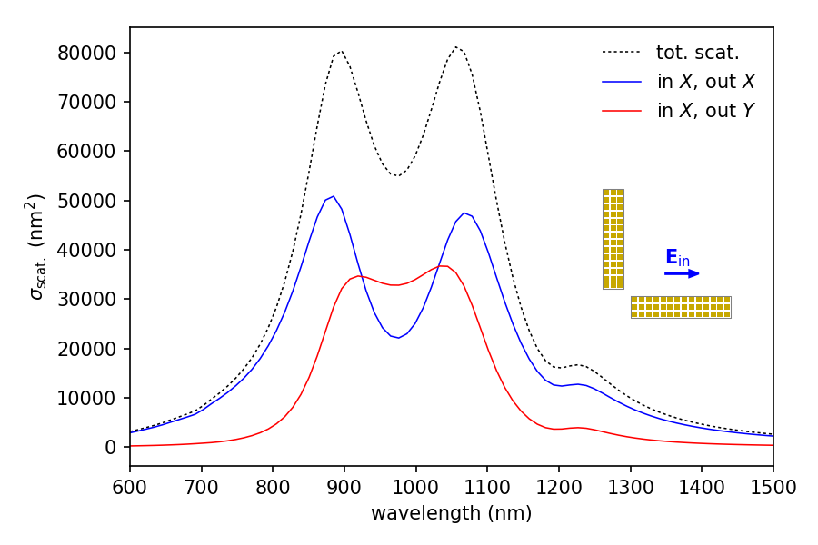

|
|

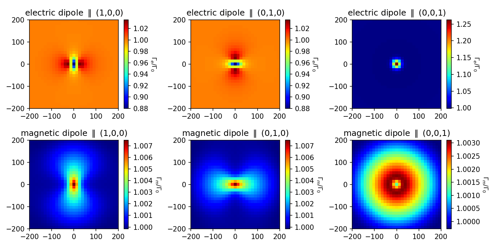

|
|

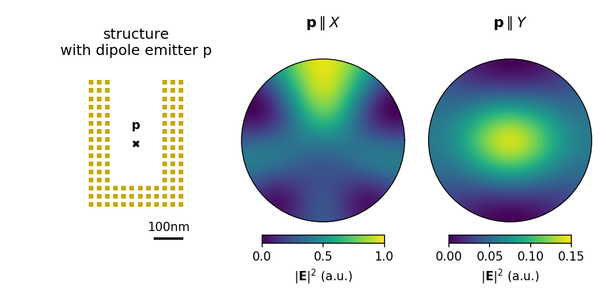

|
|

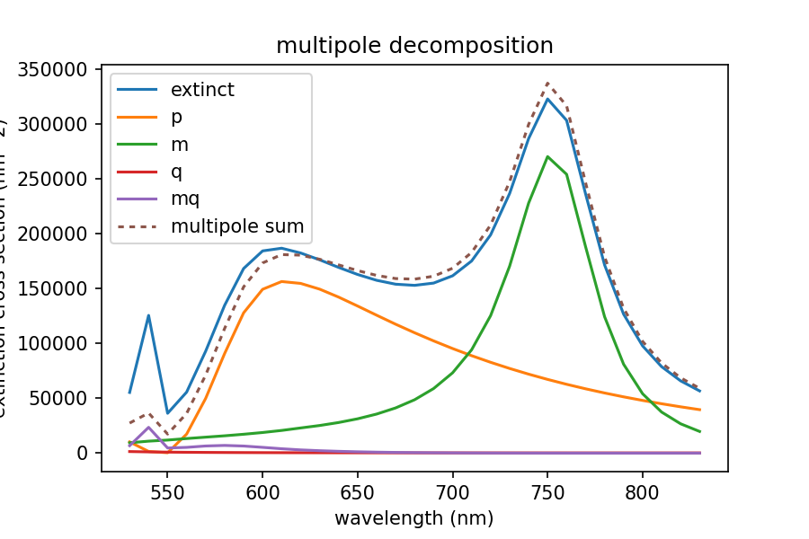

|
| 

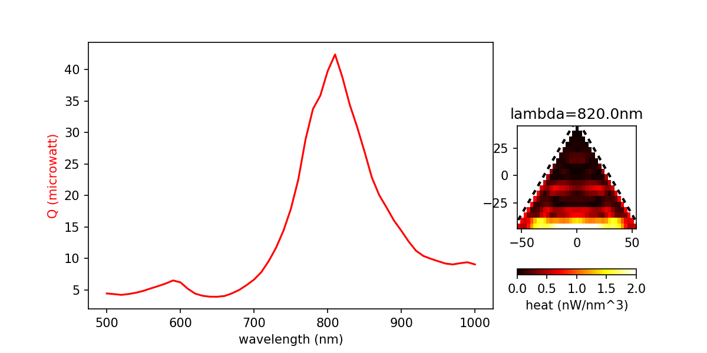

|
|

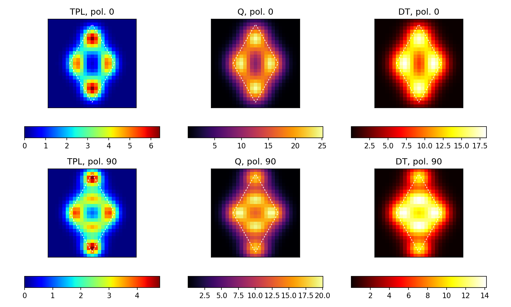

|
|

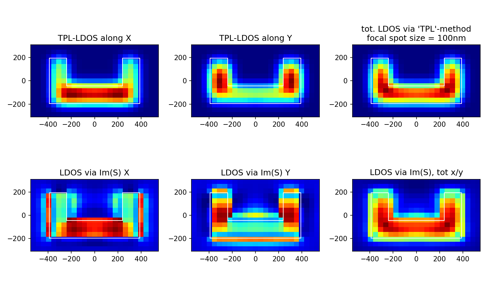

..    :align: left

