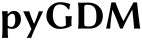

.. pyGDM documentation master file, created by
   sphinx-quickstart on Tue May 23 23:12:55 2017.
   You can adapt this file completely to your liking, but it should at least
   contain the root `toctree` directive.

.. raw:: html

    <video autoplay loop poster="_static/pyGDM_logo_static.png">
        <source src="_static/pyGDM_logo.mp4" type="video/mp4">
        <source src="_static/pyGDM_logo.webm" type="video/webm">
        Sorry, your browser doesn't support HTML5 video.
    </video>

   
Welcome to pyGDM
===============================================

pyGDM is an open source python (since v1.0.6: python 2 and python 3) 
toolkit for electro-dynamical simulations, based on the Green dyadic method (GDM). 
In contrast to most other coupled-dipole codes, pyGDM uses a generalized 
propagator, which allows to cost-efficiently treat large monochromatic problems 
such us polarization-resolved calculations or raster-scan simulations.

pyGDM includes tools to easily derive several physical quantities such 
as far-field patterns, extinction and scattering cross-sections, the electric 
and magnetic near-field in the vicinity of the structure, the multipole decomposition of 
the fields, the surface-LDOS or the heat deposited inside the nanoparticle.
pyGDM furthermore offers a toolkit for evolutionary optimization of nanoparticle 
geometries: The **EO** module allows to automatically design
nanostructures which optimize optical properties such as a certain 
resonance wavelength, strong field enhancement or the direction of scattering.

You can download the code from the `pypi repository <https://pypi.python.org/pypi/pygdm2/>`_ or clone it from `gitlab <https://gitlab.com/wiechapeter/pyGDM2>`_ (see also the :ref:`Overview<readme.rst>` section)

Please send comments, suggestions and report bugs by mail or via the `gitlab issue tracker <https://gitlab.com/wiechapeter/pyGDM2/issues>`_

.. note:: If you use pyGDM for your work, please cite `the paper <https://doi.org/10.1016/j.cpc.2018.06.017>`_ (:download:`bibtex <_downloads/pygdm.bib>`):

            |   **P. R. Wiecha**  
            |   *pyGDM - A python toolkit for full-field electro-dynamical simulations and evolutionary optimization of nanostructures*  
            |   Computer Physics Communications 233, 167-192 (2018)
            |   `DOI: 10.1016/j.cpc.2018.06.017 <https://doi.org/10.1016/j.cpc.2018.06.017>`_  
            |   (`arXiv:1802.04071 <https://arxiv.org/abs/1802.04071>`_)

pyGDM documentation
--------------------------------------

.. toctree::
   :maxdepth: 1
   :caption: Contents:

   readme
   changelog
   tutorials/01_min_working_example.ipynb 
   overview
   tutorial
   examples
   pygdmui
   gallery
   apidoc

Key features
----------------------------------

- Easy to install and easy to use: Fully relying on freely available open-source python 
  libraries (*numpy*, *scipy*, *matplotlib*)

- Fast: Performance-critical parts are implemented in *fortran* and are parallelized with *openmp*, 
  efficient and parallelized *scipy* libraries are used when possible. 
  Spectra can be calculated very rapidly via an *MPI*-parallelized routine (:ref:`example</tutorials/07_MPI_spectra.ipynb>`)

- Electro-dynamical simulations including a substrate

- Different illumination sources such as plane wave, focused beam or dipolar emitter. 
  Easy to implement own light sources in python (:ref:`tutorial</tutorials/extend_03_own_field_generator.ipynb>`)

- Efficient calculation of large monochromatic problems such as raster-scan simulations (:ref:`example</tutorials/04_rasterscans_tpl_heat.ipynb>`)

- Provide tools to rapidly post-process the simulations and derive physical quantities such as

    - near-field inside and around nanostructures (:ref:`example</tutorials/03_field_maps.ipynb>`)

    - extinction, absorption and scattering cross-sections (:ref:`example</tutorials/02_spectra.ipynb>`)
    
    - polarization- and spatially resolved far-field scattering (:ref:`example</examples/example05_splitring_with_dipole.ipynb>`)
    
    - heat generation, temperature rise around nano-objects (:ref:`example</examples/example07_heat_generation.ipynb>`)
    
    - efficient and rapid raster-scan simulations (:ref:`example</tutorials/04_rasterscans_tpl_heat.ipynb>`)
    
    - surface photonic local density of states (SP-LDOS) (:ref:`example</tutorials/05_rasterscans_ldos.ipynb>`)
    
    - modification of the decay-rate of dipolar emitters (:ref:`example</examples/example08_decay_rate.ipynb>`)
    
    - multipole decomposition of nanostructure field and extinction (:ref:`example</examples/example09_multipole_decomposition.ipynb>`)

- Many easy to use visualization tools,
  including animations of the electro-magnetic fields

- Evolutionary optimization of the nano-particle geometry with regards to specific optical properties (:ref:`example</examples/exampleEO_01_scattering.ipynb>`)

About the above animation
-------------------------------------------

The animation at the top of this page was generated from the image 

..    :align: left

with the below script. 

In the script the pyGDM function *structures.image_to_struct* is used to convert 
the bitmap pixel by pixel into a planar nano-structure: Every pixel darker than a 
specific threshold will be considered material (gold in the below example), all brighter 
pixels are part of the environment. The planar structure is then discretized on a 
cubic mesh using a pre-defined scaling and structure height.
The time-harmonic electric field inside the gold-letter structure resulting from plane wave 
illumination is then calculated using pyGDM's *core.scatter* and finally converted into a 
movie with *visu.animate_vectorfield*.

The structure is approximately 1100nm long, 300nm wide and 8nm high (one layer of 
meshpoints). It is made of gold, placed in vacuum and illuminated from your position 
towards the computer screen by a plane wave of 700nm wavelength, linearly polarized 
along 45°.

All other videos in this documentation are showing planar aluminum structures 
using a discretization of 5nm under 700nm wavelength plane wave illumination with 
-45° linear polarization. Aluminum has a far higher imaginary part of the dielectric
function, which causes high losses due to absorption inside the metal. Due to these
losses, the fields decay very quickly which looks *"smoother"*, which is why we 
use it in the here shown videos.

.. code-block:: python

        ## --- load pyGDM
        from pyGDM2 import structures
        from pyGDM2 import materials
        from pyGDM2 import fields
        
        from pyGDM2 import core
        from pyGDM2 import tools
        from pyGDM2 import visu
        
        import matplotlib.pyplot as plt
        
        
        #===============================================================
        # Setup the simulation
        #===============================================================
        ## --- structure / environment
        n1, n2 = 1.0, 1.0  # vacuum env.
        step = 8.0
        geometry = structures.image_to_struct("pyGDM_logo_static.png", 
                              useDarkPixel=1, threshold=100, H=1,
                              nm_per_pixel=1.*step, stepsize=step)
        material = materials.gold()
        struct = structures.struct(step, geometry, material, n1,n2, 
                                   structures.get_normalization('cube'))
        
        ## --- incident field
        field_generator = fields.planewave
        kwargs = dict(theta = [45.0])
        wavelengths = [700]
        efield = fields.efield(field_generator, wavelengths=wavelengths, 
                                                           kwargs=kwargs)
        
        ## --- simulation object
        sim = core.simulation(struct, efield)
        
        
        #===============================================================
        # Run the simulation
        #===============================================================
        E = core.scatter(sim)
        NF = tools.get_field_as_list_by_fieldindex(sim, 0)
            
        
        #===============================================================
        # create the field-animation
        #===============================================================
        ## setup figure / axes
        plt.figure(figsize=(6.0,2.5))
        ax = plt.subplot(aspect='equal')
        plt.axis('off')
        plt.subplots_adjust(left=0, right=1, bottom=0,top=1)

        ## geometry
        s = visu.structure(sim, scale=0.1, color='.75', show=0)

        ## field-animation
        config_vectorfield = dict(cmin=0.5, cmap=plt.cm.Blues, 
                                borders=5, vecwidth=0.8)
        ani = visu.animate_vectorfield(NF, Nframes=100, scale=12,
                                    kwargs=config_vectorfield, 
                                    ax=ax, show=False)
        ## save video to file
        ani.save('pyGDM_logo.mp4', writer="ffmpeg", 
                 codec='h264', bitrate=1500)
        
        

        
3D
--------
        
Similarly, 3D represantations of the fields can be animated using:

.. code-block:: python

        from pyGDM2 import visu3d
        from mayavi import mlab

        fig = mlab.figure( size=(600, 300), bgcolor=(1.0, 1.0, 1.0), fgcolor=(0.,0.,0.) )

        ## structure
        visu3d.structure(sim, axis_labels=False, draw_substrate=False, 
                        opacity=0.1, show=False)

        ## 3D field-animation
        ani2 = visu3d.animate_vectorfield(NF, Nframes=100, scale=8, 
                                draw_struct=False, 
                                draw_substrate=False, substrate_size=1.1, 
                                colormap='Blues', clim=[0.0, 0.5], 
                                fig=fig, view=(85, -45, 350, (0,0,-15)),
                                ffmpeg_args="-b:v 1.5M -c:v libx264", mov_file="3D.mp4",
                                save_anim=True, 
                                opacity=0.5)

which (depending on the model of course) will result in something like:

.. raw:: html

    <video autoplay loop poster="_static/3D_static.png">
        <source src="_static/3D.mp4" type="video/mp4">
        <source src="_static/3D.webm" type="video/webm">
        Sorry, your browser doesn't support HTML5 video.
    </video>

   
Indices and tables
==================

* :ref:`genindex`
* :ref:`modindex`
* :ref:`search`

