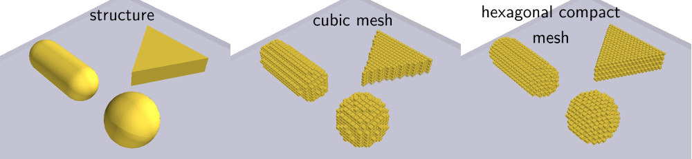
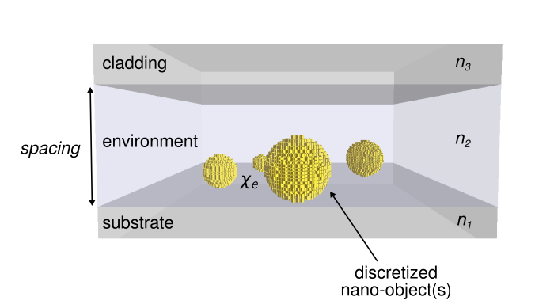
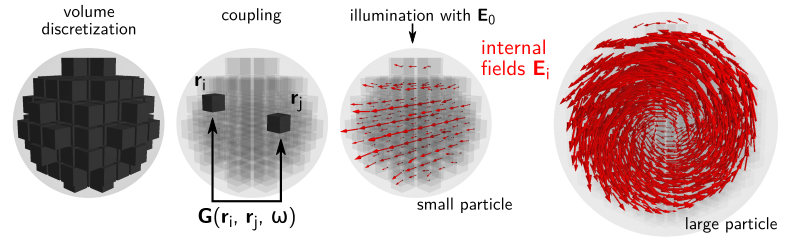

.. raw:: html

    <video autoplay loop poster="_static/overview_static.png">
        <source src="_static/overview.mp4" type="video/mp4">
        <source src="_static/overview.webm" type="video/webm">
        Sorry, your browser doesn't support HTML5 video.
    </video>

Here we give a short survey of what pyGDM does and of the underlying approximations of some of the main functionalities.

.. contents:: Table of Contents

Overview
**************************

pyGDM is based on the Green Dyadic Method (GDM) which resolves an optical Lippmann-Schwinger equation and **calculates the total field** :math:`\mathbf{E}(\mathbf{r}, \omega)` **, inside a nanostructure**, embedded in a fixed environment, upon illumination by an incident electromagnetic field :math:`\mathbf{E}_0(\mathbf{r}, \omega)`. The environment is described by the Green's tensor :math:`\mathbf{G}(\mathbf{r}, \mathbf{r'}, \omega)`:

.. math::
    \mathbf{E}(\mathbf{r}, \omega)  = 
     \mathbf{E}_0(\mathbf{r}, \omega) + 
         \int \mathbf{G}(\mathbf{r}, \mathbf{r'}, \omega) \cdot 
              \chi_{\text{e}} \cdot \mathbf{E}(\mathbf{r'}, \omega) \text{d} \mathbf{r'} 

GDM is a frequency-domain method, hence the fields are required to be monochromatic and time-harmonic.
From the complex electromagnetic fields inside the nanostructure, further physical quantities can be derived such as local fields outside the nanostructure, far-field scattering and extinction cross-sections or radiation patterns and local heat generation. It is also possible to calculate local densities of photonic states and hence the decay rates of quantum emitters close to the structure.

Volume discretization
=========================================

The GDM is a volume integral equation approach.
The volume integration runs over the nanostructure. It is numerically implemented as a **discretization of the structure volume on a regular mesh**. 
This discretization turns the integral over the nanostructure volume  into a sum of all *N* mesh cells with volume :math:`V_{\text{cell}}`. This transforms the Lippmann-Schwinger equation into a system of coupled equations, that can be resolved by matrix inversion:

.. math::
    \mathbf{E}(\mathbf{r}_i, \omega) = 
        \mathbf{E}_0(\mathbf{r}_i, \omega) +
        \sum\limits_{j=1}^{N} 
        \mathbf{G}(\mathbf{r}_i, \mathbf{r}_j, \omega) \cdot 
        \chi_{\text{e}}(\mathbf{r}_j,\omega)\cdot \mathbf{E}(\mathbf{r}_j, \omega) V_{\text{cell}}

In pyGDM, the discretization is done either on a cubic grid (center panel in image below), or on a hexagonal compact grid (right panel in image below).

..    :align: left

Simulation environment
=========================================

One advantage of GDM compared to domain discretization techniques such as FDTD is that only the nanostructure is discretized. The environment in which the nanostructure is embedded is described by the Green's dyadic function :math:`\mathbf{G}(\mathbf{r}, \mathbf{r'}, \omega)`, used in the calculation. 
As shown in the below figure, **pyGDM implements a Green's dyad for a 3-layer environmental frame, the nanostructure itself lying in the center layer**.
The used Green's dyad is based on a non-retarded near-field approximation using mirror-charges. In consequence, for example retardation effects occurring at **metallic or high-index substrates will not be correctly reflected in pyGDM**.

..    :align: left

The below code example shows how to place a nano-sphere in vacuum by setting n1=n2=n3.
By default, nanostructures are generated such, that they are lying on the interface between substrate and environment. If not specified in `structures.struct`, the spacing has a value of 5000nm. 
*Note* that the nanostructures **must** be fully inside the environment layer "n2".

.. code-block:: python

    from pyGDM2 import structures
    from pyGDM2 import materials
    
    ## discretization grid stepsize
    step = 20
    ## structure is defined as list of coordinates. Here: sphere of 120nm radius, cubic discretization
    geometry = structures.sphere(step, R=6, mesh='cube')
    ## material of nanostructure: constant refractive index
    material = materials.dummy(2.0)

    ## place the sphere in vacuum (--> no substrate: n1=n2, no cladding: n3=n2)
    n1 = 1.0
    n2 = 1.0
    n3 = 1.0   # n3 is optional, by default it is set to the value of n2

    ## all information is collected in a "structure" object
    struct = structures.struct(step, geometry, material, n1,n2, 
               n3=n3, normalization=structures.get_normalization(mesh='cube'),
               spacing=5000)

            
Fundamental fields
=========================================

The Lippmann Schwinger equation self-consistently relates the zero order field :math:`\mathbf{E}_0(\mathbf{r}, \omega)` (without presence of the nanostructure) and the field :math:`\mathbf{E}(\mathbf{r}, \omega)` upon interaction of the field with the nanostructure. Hence, any incident field :math:`\mathbf{E}_0(\mathbf{r}, \omega)` can be used to excite the nanostructure. Several illumination field generators are available in pyGDM, with the possibility to easily write custom extensions and own fields (:ref:`see example</tutorials/extend_03_own_field_generator.ipynb>`).

            
Coupled dipole simulation
=========================================

The main part of a pyGDM simulation is the calculation of the internal fields :math:`\mathbf{E}(\mathbf{r}, \omega)` inside the nanostructure, by solving the discretized Lippmann Schwinger equation as given above.
The matrix that defines this system of equations is determined by the Green's Dyads :math:`\mathbf{G}(\mathbf{r}_i, \mathbf{r}_j, \omega)`, coupling all pairs of mesh-cells at :math:`\mathbf{r}_i` and :math:`\mathbf{r}_j` of the structure.

pyGDM, uses a near-field approximation of the Green's Dyad for a layered system of 3 layers, which can be derived through the method of mirror charges. Hence, the approximation assumes that every mesh-point induces a mirror dipole in the substrate as well as in the cladding layer.
This approximation is valid in the near-field region, when retardation effects can be neglected.

..    :align: left

